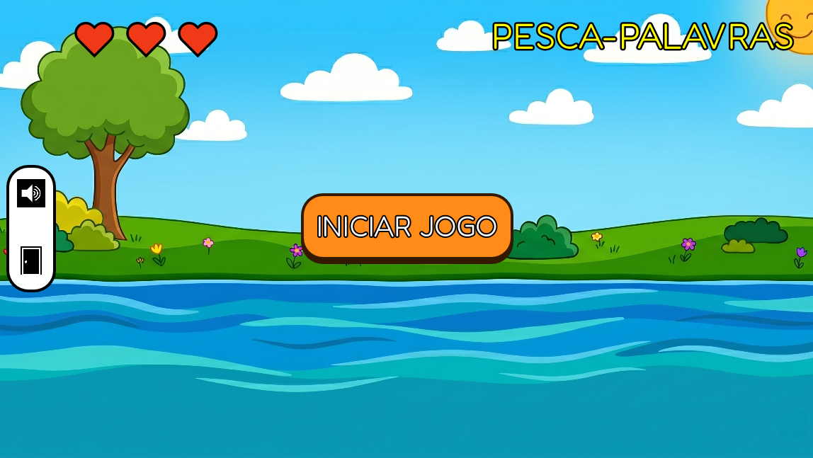
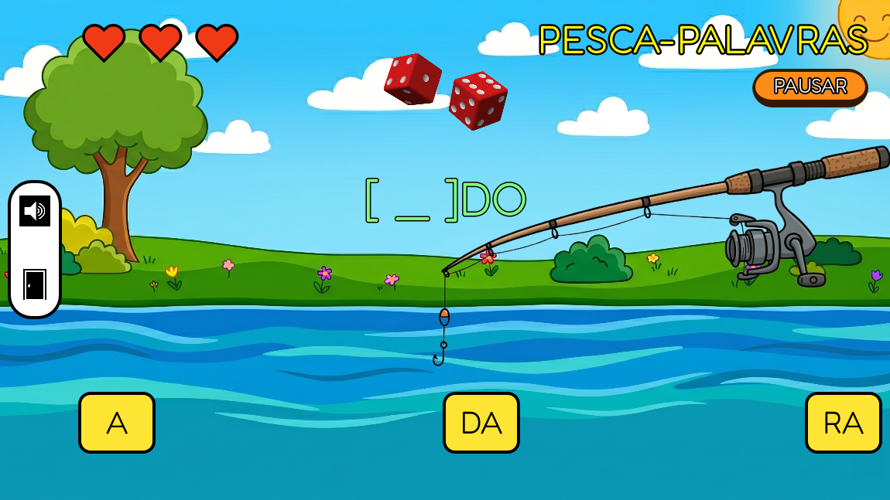

# 🎣 Pesca-Sílabas

O Pesca-Sílabas é um jogo educacional que integra o projeto **NinoEdu**. 

Este projeto utiliza o **Método ABACADA**, uma técnica de alfabetização fonética e silábica que organiza o aprendizado através de famílias silábicas simples e repetitivas. O nome deriva da sequência de consoantes aliadas à vogal "A" (BA, CA, DA...), estabelecendo uma base lógica antes de avançar para outras vogais e complexidades. O foco é reduzir a carga cognitiva, facilitando a memorização de padrões e a construção de palavras de forma sequencial e previsível.

Desenvolvido especificamente como uma ferramenta de tecnologia assistiva para crianças atendidas pela **APAE** (Associação de Pais e Amigos dos Excepcionais), o jogo transforma o aprendizado em algo mais divertido e lúdico. Com uma interface amigável, suporte de áudio narrado e integração de imagens e sons, o jogador precisa pescar a sílaba correta que completa a palavra. O jogo é projetado para ser acessível, promovendo a autonomia e a inclusão de alunos com diferentes necessidades educacionais, especialmente aqueles com deficiências intelectuais ou transtornos do desenvolvimento.

---

## 🧠 1. Contribuições Pedagógicas

O **Pesca-Sílabas** atua como uma ferramenta de intervenção psicopedagógica para alunos da **APAE**, sendo ideal para crianças com deficiências intelectuais, transtornos do desenvolvimento ou dificuldades de aprendizagem (como dislexia).

Suas principais contribuições incluem:

* **Aplicação do Método ABACADA:** O jogo foca na clareza silábica, permitindo que a criança identifique padrões fonéticos isolados antes de formar a palavra completa. Isso reduz a carga cognitiva e facilita a alfabetização através da repetição estruturada.
* **Associação Visual e Auditiva:** Reforça a ligação entre o som (fonema), a escrita (grafema) e a imagem (significado). O reforço sonoro constante é vital para o aprendizado de alunos neuroatípicos.
* **Tolerância ao Erro e Reforço Positivo:** Na educação especial, a frustração é um grande barreira. No jogo, o erro não zera o progresso, pois a vitória é alcançada por acertos totais, não consecutivos, incentivando a persistência e a autoestima do aluno.
* **Desenvolvimento da Coordenação Motora e Foco:** O rastreamento visual das sílabas em movimento e o clique preciso estimulam a coordenação motora e a atenção.
* **Locução:** A narração de todos os botões e mensagens permite que alunos que ainda não dominam a leitura naveguem pelo jogo com autonomia.

---
## 🎮 2. Como Jogar

O jogo é intuitivo e fácil de ser compreendido.

### Passo 1: Tela Inicial
Ao abrir o jogo, a criança será recebida por um vídeo introdutório do projeto NinoEdu. Assim que a introdução termina, o botão central é liberado. Basta passar o mouse por cima (para ouvir a instrução) e clicar em **"INICIAR JOGO"**.




### Passo 2: O Desafio
No topo da tela, aparecerá a imagem de um objeto ou animal (ex: 🎲 Dado), junto do texto incompleto `[ _ ] DO`.
Sílabas variadas começarão a passar flutuando na parte inferior da tela, da direita para a esquerda.

### Passo 3: Pescando a Sílaba
A criança deve identificar qual sílaba completa a palavra. Quando a sílaba correta (neste caso, "DA") passar pela área da vara de pesca, ela deve **clicar com o botão esquerdo do mouse** ou apertar a **barra de espaço**.



* **Se acertar:** A caixinha fica verde, toca o som da sílaba, um som de acerto, e depois o jogo lê a palavra completa formada ("Dado"). A velocidade em que as sílabas passam aumenta para o próximo desafio!
* **Se errar:** A caixinha fica vermelha, toca um som indicativo de erro e o jogador perde um coração de vida. O jogo continua normalmente para que ele tente pescar a sílaba certa.

### Passo 4: Vitória ou Tentativa
Ao acumular 3 acertos (mesmo que cometa erros no caminho), o jogador vence, é parabenizado e pode escolher continuar pescando. Se perder todos os 3 corações, ele é encorajado a tentar novamente.

## 📁 3. Estrutura e Organização do Projeto

O projeto foi construído na engine **Godot 4**. O jogo possui também um sistema de Fallback, ou seja, tenta baixar os dados da API do NinoEdu localmente no Docker e, se não conseguir, utiliza os arquivos locais.

A estrutura de pastas está organizada da seguinte forma:

```text
📂 pesca-silabas/
├── 📄 Main.gd         # Cuida das regras, timers, instâncias e lógica principal.
├── 📄 project.godot   # Arquivo de configuração da engine Godot.
├── 📁 audios/         # Contém todos os efeitos sonoros, música de fundo e locuções.
├── 📁 fontes/         # Arquivos de tipografia (fonte)
├── 📁 icones/         # Ícones da interface de usuário.
├── 📁 imagens/        # Imagens fixas da interface.
└── 📁 videos/         # Arquivos de vídeo (como a intro do Ninoedu).
```